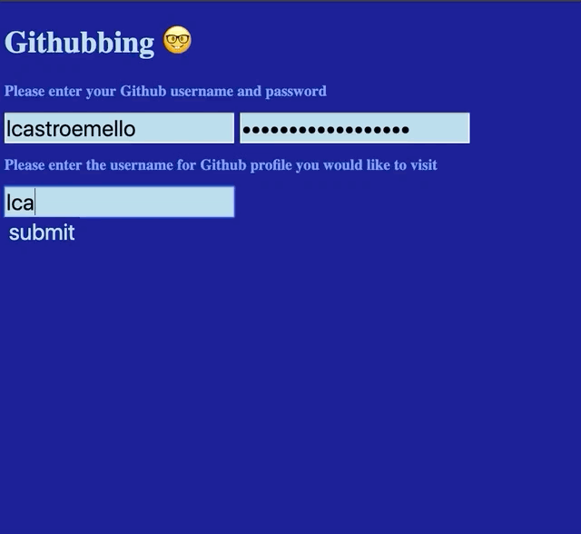

# GITHUBBING - Search users and commits in GitHub

## Description

Search engine allowing users registered in GitHub to search other user profiles and have a summarized view of their last commits.

## Developed with

- JavaScript / JQuery 
- Handlebars
- Ajax requests
- GitHub API
- HTML / CSS

## Features

To make a search, our users need to require access using their own credentials as registered users in GitHub. By typing their username and password, they can also search for the last commits of a determined user

Upon a positive response from GitHub on the user's credentials, the user also receives a list of the last repositories that received commits  by the user searched: 

After that it is also possible to enter a list of the last ten commits made on each repository

